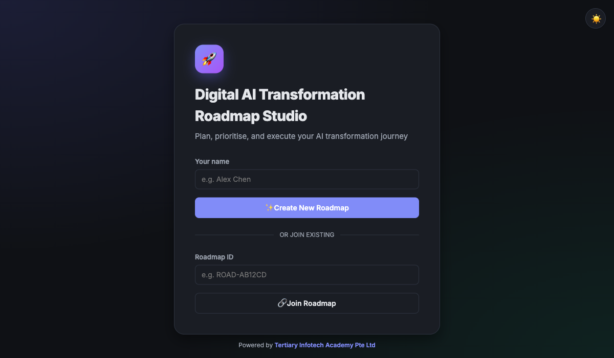

<div align="center">

# Digital AI Transformation Roadmap Studio

[](https://developer.mozilla.org/docs/Web/HTML)
[](https://developer.mozilla.org/docs/Web/CSS)
[](https://developer.mozilla.org/docs/Web/JavaScript)
[](https://firebase.google.com/)
[](https://github.com/davidshimjs/qrcodejs)
[](https://opensource.org/licenses/MIT)

**Plan, prioritise, and execute your AI transformation journey — collaboratively, in real time.**

[Live Demo](https://alfredang.github.io/digitaltransformation/) · [Report Bug](https://github.com/alfredang/digitaltransformation/issues) · [Request Feature](https://github.com/alfredang/digitaltransformation/issues)

</div>

## Screenshot



## About

Digital AI Transformation Roadmap Studio is a lightweight, collaborative web app that helps organisations plan, prioritise, and track their digital and AI transformation journey. Teams can join a shared roadmap by scanning a QR code or entering a Roadmap ID — no signup required.

### Key Features

| Module | Description |
|---|---|
| 🚀 **Real-time Collaboration** | Multiple users edit the same roadmap simultaneously via Firebase Realtime Database |
| 📱 **QR Code Invites** | Generate a QR code so teammates can join from their phone instantly |
| 🎯 **Phases & Initiatives** | Organise work across Discovery → Pilot → Scale → Optimise phases |
| ⚡ **Impact vs Effort Matrix** | Visualise priorities — Quick Wins, Major Projects, Fill-ins, Thankless |
| 📈 **Maturity Assessment** | Score 8 capability dimensions on a 1–5 CMMI-style scale |
| 📅 **12-Month Timeline** | Gantt-style view of initiatives across the year |
| ⚠️ **Risk Register** | Likelihood × Impact scoring with mitigation plans |
| 🎯 **KPI Tracking** | Current vs target metrics with progress bars |
| 💬 **Team Discussion** | Built-in chat for roadmap collaboration |
| 🌗 **Dark / Light Themes** | Defaults to dark mode, with a one-click toggle |
| 📱 **Mobile-friendly** | Fully responsive — works on phones, tablets, and desktops |
| ⬇️ **JSON Export** | Download the entire roadmap for backup or reporting |

## Tech Stack

| Category | Technology |
|---|---|
| **Frontend** | HTML5, CSS3 (custom design system, no framework), Vanilla JavaScript |
| **Real-time DB** | Firebase Realtime Database (compat SDK v9.23.0) |
| **Auth** | Firebase Anonymous Authentication |
| **QR Codes** | [QRCode.js](https://github.com/davidshimjs/qrcodejs) |
| **Fonts** | Inter (Google Fonts) |
| **Hosting** | GitHub Pages (via GitHub Actions) |

> No build step, no bundler, no npm install — open `index.html` and you're running.

## Architecture

```
┌─────────────────────────────────────────────────────────┐
│                      Browser (Client)                   │
│  ┌──────────────────────────────────────────────────┐   │
│  │         index.html  (HTML + CSS + JS)            │   │
│  │  ┌─────────────┐  ┌────────────┐  ┌──────────┐   │   │
│  │  │  Landing    │  │  Roadmap   │  │  Modals  │   │   │
│  │  │  & Join     │  │  Workspace │  │  & QR    │   │   │
│  │  └─────────────┘  └────────────┘  └──────────┘   │   │
│  └──────────────────────────────────────────────────┘   │
│         │                  │                  │         │
│  ┌──────▼─────┐    ┌───────▼──────┐    ┌─────▼──────┐   │
│  │ QRCode.js  │    │   Firebase   │    │ localStorage│   │
│  │  (CDN)     │    │   SDK (CDN)  │    │  (fallback) │   │
│  └────────────┘    └───────┬──────┘    └─────────────┘   │
└─────────────────────────────│───────────────────────────┘
                              │
                              ▼
        ┌─────────────────────────────────────┐
        │   Firebase Realtime Database        │
        │  ┌───────────────────────────────┐  │
        │  │ roadmaps/                     │  │
        │  │   └─ {ROAD-ID}/               │  │
        │  │       ├─ name, vision, org    │  │
        │  │       ├─ initiatives/         │  │
        │  │       ├─ risks/               │  │
        │  │       ├─ kpis/                │  │
        │  │       ├─ comments/            │  │
        │  │       ├─ maturity/            │  │
        │  │       └─ members/ (presence)  │  │
        │  └───────────────────────────────┘  │
        └─────────────────────────────────────┘
```

## Project Structure

```
digitaltransformation/
├── index.html                    # Single-page app (HTML + CSS + JS)
├── firebase-config.js            # Your Firebase config (gitignored)
├── firebase-config.example.js    # Template for Firebase config
├── .env                          # Source-of-truth env values (gitignored)
├── .gitignore                    # Excludes secrets and OS files
├── screenshot.png                # README screenshot
├── README.md                     # This file
└── .github/
    └── workflows/
        └── deploy.yml            # GitHub Pages deployment
```

## Getting Started

### Prerequisites

- A modern web browser (Chrome, Firefox, Safari, Edge)
- A [Firebase project](https://console.firebase.google.com/) with Realtime Database + Anonymous Auth enabled (optional — falls back to localStorage)

### 1. Clone the Repository

```bash
git clone https://github.com/alfredang/digitaltransformation.git
cd digitaltransformation
```

### 2. Configure Firebase (Optional but Recommended)

Copy the example config and fill in your project values:

```bash
cp firebase-config.example.js firebase-config.js
```

Edit `firebase-config.js`:

```javascript
window.firebaseConfig = {
  apiKey: "YOUR_API_KEY",
  authDomain: "your-project.firebaseapp.com",
  databaseURL: "https://your-project-default-rtdb.firebaseio.com",
  projectId: "your-project",
  storageBucket: "your-project.appspot.com",
  messagingSenderId: "000000000000",
  appId: "1:000000000000:web:0000000000000000000000"
};
```

In the Firebase Console:
1. **Build → Realtime Database** → Create Database → Start in test mode
2. **Build → Authentication** → Sign-in method → Enable **Anonymous**
3. **Database → Rules** → set:

```json
{
  "rules": {
    "roadmaps": {
      "$id": { ".read": "auth != null", ".write": "auth != null" }
    }
  }
}
```

### 3. Run Locally

Any static-file server works:

```bash
# Python
python3 -m http.server 8765

# Node.js
npx serve .

# PHP
php -S localhost:8765
```

Then open **http://localhost:8765/index.html**

> Without a Firebase config the app runs in localStorage mode — fully functional on a single device, but no real-time sync.

## Deployment

### GitHub Pages (Recommended — included)

This repo includes a GitHub Actions workflow at `.github/workflows/deploy.yml` that auto-deploys on every push to `main`. To enable:

1. Push to GitHub
2. Repo **Settings → Pages → Source → GitHub Actions**
3. The site is live at `https://<username>.github.io/digitaltransformation/`

> ⚠️ `firebase-config.js` is gitignored — you'll need to either commit a public-safe variant or inject it at build time. See **Security Notes** below.

### Other Platforms

| Platform | Steps |
|---|---|
| **Vercel** | `npx vercel --yes` |
| **Netlify** | Drag-and-drop the folder at [app.netlify.com](https://app.netlify.com/) |
| **Firebase Hosting** | `firebase init hosting && firebase deploy` |
| **Cloudflare Pages** | Connect the repo at [pages.cloudflare.com](https://pages.cloudflare.com/) |

## Security Notes

Firebase web `apiKey` is **not a secret** — it's a public project identifier visible in any browser. Real protection comes from:

- ✅ **Database Rules** with `auth != null` (already in setup)
- ✅ **App Check** with reCAPTCHA v3 — Firebase Console → Build → App Check
- ✅ **Authorized Domains** — Authentication → Settings → Authorized domains
- ✅ **Budget alerts** — Project Settings → Usage and billing

`.env` and `firebase-config.js` are gitignored to keep them out of source control, but treat the `apiKey` as public information once deployed.

## Contributing

Contributions, issues, and feature requests are welcome.

1. Fork the repository
2. Create your feature branch (`git checkout -b feature/amazing-feature`)
3. Commit your changes (`git commit -m 'Add amazing feature'`)
4. Push to the branch (`git push origin feature/amazing-feature`)
5. Open a Pull Request

Discussion: [GitHub Discussions](https://github.com/alfredang/digitaltransformation/discussions)

## License

Distributed under the MIT License. See `LICENSE` for more information.

## Developed By

**[Tertiary Infotech Academy Pte Ltd](https://www.tertiarycourses.com.sg/)**

A Singapore-based training and consultancy provider specialising in digital, AI, and emerging technologies.

## Acknowledgements

- [Firebase](https://firebase.google.com/) — Real-time database & anonymous auth
- [QRCode.js](https://github.com/davidshimjs/qrcodejs) — QR code generation
- [Inter](https://rsms.me/inter/) by Rasmus Andersson — Typography
- [Shields.io](https://shields.io/) — Badges
- The open-source community ❤️

---

<div align="center">

**If you find this project useful, please ⭐ star the repo!**

Made with ❤️ for digital transformation leaders

</div>
